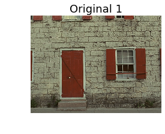

# Einfluss von Kompression auf die visuelle Wahrnehmung von Bildern

## Projekt von Dominik T., Benjamin, Pascal

### Seminar: Visuelle Wahrnehmung von Menschen und Bildqualität - SoSe 2021


```python
import pandas as pd
import seaborn as sns
import matplotlib.pyplot as plt
import numpy as np
import matplotlib.image as mpimg
sns.set_context('talk')
```

## 1. Einleitung
Im Rahmen des Seminars "Visuelle Wahrnehmung von Menschen und Bildqualität" wurden verschiedene Effekte von Bildmanipulation auf die visuelle Wahrnehmung der Menschen untersucht und wie verschiedene maschinelle Bewertungsalgorithmen die menschliche Wahrnehmung antizipieren können. In unserem Versuch haben wir untersucht, welchen Einfluss JPEG-Kompression in unterschiedlichen Stufen auf die vom Menschen wahrgenommene Bildqualität hat. 
Die Relevanz dieser Forschungsfrage besteht darin, dass Kompression sowohl für die persistente Datenspeicherung, als auch für die Übertragung von Daten von elementarer Bedeutung ist. Durch die erreichte Reduzierung der Dateigröße können so deutlich mehr Inhalte gespeichert bzw. versendet werden, ohne sinnvolle Informationen der Inhalte zu verlieren.

Um nun diese komplexe Forschungsfrage einzugrenzen, haben wir uns bei den verwendeten Stimuli auf Farbbilder geeinigt, die unter Tageslichteinfluss aufgenommen wurden und eine positive Ausstrahlung besitzen, wobei die verwendeten Motive sowohl Tier- und Menschenporträts, als auch Landschafts- und Architekturmotive abdecken.

Unsere untersuchten Hypothesen in diesem Zusammenhang waren, dass das Level an Bildkompression in keinem linearen Zusammenhang zu der wahrgenommenen Bildqualität der komprimierten Bilder steht und, dass es ein allgemeingültiges optimales Level an Bildkompression gibt, welches sich von 0% unterscheidet. 

## 2. Experimentelles Design
Wir haben zehn verschiedene Farbbilder aus der Tampere Image Database 2008 ausgewählt, welche alle eine initiale Spechergröße von 576 kB hatten, eine Bildgröße von 512 x 384 Pixeln aufwiesen und im BMP Format gespeichert wurden. Auf diese zehn Bilder haben wird dann eine JPEG-Kompression in 10 Stufen angewendet, welche eine Bandbreite von 10% bis 100% aufwiesen, und sich in 10% Schritten voneinander unterschieden. Zur Kompression haben wir das Online-Tool von [11zon](https://imagecompressor.11zon.com/en/compress-jpeg/) verwendet.

Der folgende Absatz zeigt alle verwendeten Stimuli.


```python
quality = [10, 20, 30, 40, 50, 60, 70, 80, 90, 100]

# Bild 1
plt.figure(figsize=(6, 3))
im = mpimg.imread('project_code/img/i01.bmp')
plt.subplot(1, 1, 1)
plt.imshow(im) 
plt.axis('off')
plt.title('Original 1')
    
plt.figure(figsize=(24, 8))
for  i, q in enumerate(quality):
    im = mpimg.imread('project_code/img/c%d/i01_1_11zon.bmp' % q)
    plt.subplot(2, 5, i+1)
    plt.imshow(im) 
    plt.axis('off')
    plt.title('Kompression = %d' % q)

# Bild 2
plt.figure(figsize=(6, 3))
im = mpimg.imread('project_code/img/i02.bmp')
plt.subplot(1, 1, 1)
plt.imshow(im) 
plt.axis('off')
plt.title('Original 2')
    
plt.figure(figsize=(24, 8))
for  i, q in enumerate(quality):
    im = mpimg.imread('project_code/img/c%d/i02_2_11zon.bmp' % q)
    plt.subplot(2, 5, i+1)
    plt.imshow(im) 
    plt.axis('off')
    plt.title('Kompression = %d' % q)

# Bild 3
plt.figure(figsize=(6, 3))
im = mpimg.imread('project_code/img/i03.bmp')
plt.subplot(1, 1, 1)
plt.imshow(im) 
plt.axis('off')
plt.title('Original 3')
    
plt.figure(figsize=(24, 8))
for  i, q in enumerate(quality):
    im = mpimg.imread('project_code/img/c%d/i03_3_11zon.bmp' % q)
    plt.subplot(2, 5, i+1)
    plt.imshow(im) 
    plt.axis('off')
    plt.title('Kompression = %d' % q)
    
# Bild 4
plt.figure(figsize=(6, 3))
im = mpimg.imread('project_code/img/i04.bmp')
plt.subplot(1, 1, 1)
plt.imshow(im) 
plt.axis('off')
plt.title('Original 4')
    
plt.figure(figsize=(24, 8))
for  i, q in enumerate(quality):
    im = mpimg.imread('project_code/img/c%d/i04_4_11zon.bmp' % q)
    plt.subplot(2, 5, i+1)
    plt.imshow(im) 
    plt.axis('off')
    plt.title('Kompression = %d' % q)
    
# Bild 5
plt.figure(figsize=(6, 3))
im = mpimg.imread('project_code/img/i05.bmp')
plt.subplot(1, 1, 1)
plt.imshow(im) 
plt.axis('off')
plt.title('Original 5')
    
plt.figure(figsize=(24, 8))
for  i, q in enumerate(quality):
    im = mpimg.imread('project_code/img/c%d/i05_5_11zon.bmp' % q)
    plt.subplot(2, 5, i+1)
    plt.imshow(im) 
    plt.axis('off')
    plt.title('Kompression = %d' % q)
    
# Bild 6
plt.figure(figsize=(6, 3))
im = mpimg.imread('project_code/img/i06.bmp')
plt.subplot(1, 1, 1)
plt.imshow(im) 
plt.axis('off')
plt.title('Original 6')
    
plt.figure(figsize=(24, 8))
for  i, q in enumerate(quality):
    im = mpimg.imread('project_code/img/c%d/i06_6_11zon.bmp' % q)
    plt.subplot(2, 5, i+1)
    plt.imshow(im) 
    plt.axis('off')
    plt.title('Kompression = %d' % q)
    
# Bild 7
plt.figure(figsize=(6, 3))
im = mpimg.imread('project_code/img/i07.bmp')
plt.subplot(1, 1, 1)
plt.imshow(im) 
plt.axis('off')
plt.title('Original 7')
    
plt.figure(figsize=(24, 8))
for  i, q in enumerate(quality):
    im = mpimg.imread('project_code/img/c%d/i07_7_11zon.bmp' % q)
    plt.subplot(2, 5, i+1)
    plt.imshow(im) 
    plt.axis('off')
    plt.title('Kompression = %d' % q)
    
# Bild 8
plt.figure(figsize=(6, 3))
im = mpimg.imread('project_code/img/i08.bmp')
plt.subplot(1, 1, 1)
plt.imshow(im) 
plt.axis('off')
plt.title('Original 8')
    
plt.figure(figsize=(24, 8))
for  i, q in enumerate(quality):
    im = mpimg.imread('project_code/img/c%d/i08_8_11zon.bmp' % q)
    plt.subplot(2, 5, i+1)
    plt.imshow(im) 
    plt.axis('off')
    plt.title('Kompression = %d' % q)
    
# Bild 9
plt.figure(figsize=(6, 3))
im = mpimg.imread('project_code/img/i09.bmp')
plt.subplot(1, 1, 1)
plt.imshow(im) 
plt.axis('off')
plt.title('Original 9')
    
plt.figure(figsize=(24, 8))
for  i, q in enumerate(quality):
    im = mpimg.imread('project_code/img/c%d/i09_9_11zon.bmp' % q)
    plt.subplot(2, 5, i+1)
    plt.imshow(im) 
    plt.axis('off')
    plt.title('Kompression = %d' % q)
    
# Bild 10
plt.figure(figsize=(6, 3))
im = mpimg.imread('project_code/img/i10.bmp')
plt.subplot(1, 1, 1)
plt.imshow(im) 
plt.axis('off')
plt.title('Original 10')
    
plt.figure(figsize=(24, 8))
for  i, q in enumerate(quality):
    im = mpimg.imread('project_code/img/c%d/i10_10_11zon.bmp' % q)
    plt.subplot(2, 5, i+1)
    plt.imshow(im) 
    plt.axis('off')
    plt.title('Kompression = %d' % q)
```





10 Personen haben den Test über ein pythonbasiertes Befragungstool durchgeführt, wobei ein Double Stimulus Assessment in Kombination mit einem Degredation Category Rating verwendet wurde.
Die Testpersonen haben in jedem Durchlauf ein komprimiertes Bild mit dem jeweiligen Original verglichen. Anschließend wurde auf einer Skala von 1 bis 7 bewertet, wie sehr die Bildqualität durch die Kompression leidet.
Der Wert 1 steht für keinen sichtbaren Effekt, 4 für einen sichtbaren hinnehmbaren Effekt und 7 für einen sehr starken nicht hinnehmbaren Effekt. 
Die Testperson wusste dabei immer, welches das Original und welches das bearbeitete Bild ist, die Abfolge der Bilder und Kompressionsstufen erfolgte aber randomisiert. Damit der Test unter gleichen Bedingungen durchgeführt wird, wurde für ähnliche Monitoreinstellungen und Lichtverhältnisse an den verschieden Befragungsorten gesorgt.

Die Ergebnisse aller Testpersonen wurden dann mittels des Mean Opinion Score pro Bild und pro Kompressionslevel zusammengefasst, um einen möglichen Zusammenhang zwischen den Bildern und Kompressionsstufen zu untersuchen.

Zusätzlich wurde für jedes komprimierte Bild noch die Speichergröße dokumentiert, um auch diese später zu analysieren.

## 3. Ergebnisse
Für eine optimale Analyse wurden die Antworten bei der Abfrage nach der wahrgenommen Qualität auf ein diskretes Array von 0 bis 6 gemappt, wobei 1 für den Wert 6 steht und 7 für die 0.


```python
# Einlesen der Daten
b1 = pd.read_csv('project_code/refactored/design_rating_double_results_b1_refactored.csv')

combined = pd.read_csv('project_code/refactored/combined_data.csv')
```

### Ergebisse einer Testperson
Nachfolgend werden zuerst die Ergebnisse einer Testperson ausgewertet. Diese hatte sich bei den Antworten nicht als Ausreißer gekennzeichnet, weshalb sich die Daten zu Demonstrationszwecken eignen.


```python
g = sns.relplot(x='test_image', y='response', data=b1 ,kind='line', ci='sd', col='reference_image', 
            col_wrap = 5)
g.set_ylabels('Qualität')
g.set_xlabels('Kompressionslevel')
g.set_titles('Bild {col_name}')
g.set(ylim = (0, 6))
```


    <seaborn.axisgrid.FacetGrid at 0x17a7b4d7198>


Man kann erkennen, dass die Graphen, welche aus den Antworten resultieren, einen sehr chaotischen Verlauf haben, weshalb sich mögliche Zusammenhänge zwischen den Bildern nur schwer erkennen lassen. Dennoch sticht Bild 5 durch einen äußerst chaotischen Verlauf hervor, der gerade im Bereich zwischen 20 und 60 Prozent Kompression willkürlich zu sein scheint. Genauere Erkenntnisse lassen sich anhand dieser Daten aber nicht schließen.

### Ergebnisse aller Testpersonen
Zusammenfassung der Daten aller Testpersonen nach dem Mean Opinion.


```python
g = sns.relplot(x='test_image', y='response', data=combined, kind='line', ci='sd', col='reference_image', 
                col_wrap = 5)
g.set_ylabels('Qualität')
g.set_xlabels('Kompression')
g.set(ylim = (0, 6))
g.set_titles('Bild {col_name}')
g.savefig('moin.jpg')
```


Die zusammenfassende Darstellung lässt die Zusammenhänge und Trends deutlich leichter erscheinen. Es lässt sich erkennen, dass alle Graphen einen progressiv negativen Verlauf haben. 
Die Graphen der Bilder 2, 8 und 10 stechen hierbei durch einen sehr klaren, nicht sprunghaften Verlauf und durch eine geringe Standardabweichung heraus. 
Auffällig sind zudem die  Graphen der Bilder 5, 6 und 7, da sie einen äußerst unklaren Verlauf besitzen, welcher durch große Sprünge zwischen den Kompressionsleveln und hohe Standardabweichungen hervorsticht.

Es lassen sich auch Auffälligkeiten entdecken, wenn man nicht nur die numerische Bewertungsskala betrachtet. So lässt sich die Skala zusätzlich in 3 Bereiche aufteilen, wobei der Bereich von 4 bis 6 für keine oder nur leichte wahrnembare Veränderungen steht. Der Bereich von 2 bis 3 steht für eine wahrnembare Veränderung und der Bereich von 1 bis 0 für eine nicht hinnehmbare stark wahrnehmbare Veränderung. 
Der Bereich der nicht hinnehmbaren Veränderung zeichnet sich dadurch aus, dass obwohl alle Bilder unterschiedliche graphische Verläufe aufweisen, alle diesen Bereich bei 90% bis 95% Kompression erreichen.
Für den Bereich keine bis leichte Veränderung ist zu sehen, dass dieser bei allen Bildern bei einem Kompressionslevel von 65% bis 80% erreicht wird und nur die Bilder 5 und 6 diesen schon bei 40% erreichen. 

Dies zeigt also, dass die Bilder 5 und 6 den Punkt, ab welchem Veränderungen für den Menschen deutlich wahrnehmbar werden, bereits bei einem signifikant geringeren Kompressionslevel erreichen. Gleichzeitig erreichen sie aber den Punkt, ab welchem die graphischen Veränderungen nicht mehr hinnehmbar wären, an einem ähnlichen Punkt, wie die restlichen Bilder.

### Zusammenhang zwischen Kompression und Speicherreduktion
Im Folgenden wird der Zusammenhang zwischen der Kompression und der Speichergröße dargestellt.


```python
g = sns.relplot(x='test_image', y='img_size', data=combined, kind='line', ci='sd', col='reference_image', 
                col_wrap = 5)
g.set_ylabels('Speichergröße (Btye)')
g.set_xlabels('Kompressionslevel')
g.set_titles('Bild {col_name}')
```


    <seaborn.axisgrid.FacetGrid at 0x17a746fbda0>


Es lässt sich erkennen, dass alle Graphen einen ähnlichen Verlauf haben, wobei die absoluten Werte deutliche Unterschiede aufweisen. So hat Bild 2 bei 20% Kompression einen halb so hohen Speicherverbrauch wie Bild 6, obwohl beide im Original eine gleiche Speicherauslastung aufwiesen.

Auffallend ist hier, dass alle Graphen bei 20% Kompression eine Art Break-Point haben, ab welchem die Speicherreduktion in Abhängigkeit von dem Kompressionslevel abnimmt. Dieser Break-Point könnte in einer zukünftigen Untersuchung eventuell dabei helfen, ein optimales Kompressionslevel zu finden.

## 4. Interpretation
### Analyse der Ausreißer
Wie bereits in den Ergebnissen aufgefallen ist, stechen die Bilder 5 und 6 besonders hervor, indem sie sich durch einen äußerst unklaren Verlauf bei der Bewertung der Bildqualität und schneller sichtbare Veränderungen durch die Kompression auszeichnen. 
Wenn man nun die Bilder zum Beispiel mit den Bildern 2 und 10 vergleicht, welche ja durch einen besonders klaren Verlauf auffallen, lassen sich eventuelle Ursachen schnell erkennen. 

Der Effekt des unklaren Verlauf lässt sich damit erklären, dass die Testprobanden es deutlich schwerer fanden, die Bildqualität der Bilder 5 und 6 auf den unterschiedlichen Kompressionsleveln zu vergleichen. Die Ursache hiervon könnte sein, dass die Bilder 5 und 6 keinen wirklichen Fokus im Bild haben. Bild 2 ist ein Porträt von einem Frauengesicht, Bild 10 eine Nahaufnahme von zwei Papageien. Die Gemeinsamkeit beider Bilder liegt hierbei darin, dass beide Bilder einen klaren Fixpunkt haben, an welchem eventuelle Auswirkungen der Kompression leicht gesehen und im Gedächtnis gespeichert werden können. Bild 5 hat zwar diesen Fixpunkt ebenfalls mit dem Boot, jedoch ist dieser viel komplexer als zum Beispiel das Frauengesicht, wodurch mögliche Unterschiede eventuell nicht beachtet werden, Bild 6 hat diesen Fixpunkt aber gar nicht.
Aus diesen Gründen und dem Grund, dass die Testpersonen die Kompressionsstufen nicht direkt miteinander verglichen haben, sondern immer anhand des Originals, waren die genannten Bilder 5 und 6 deutlich schwerer zu bewerten, was sich durch den uneindeutigen Verlauf der Graphen kennzeichnet.

Der Effekt, dass die Veränderungen bei den Bildern 5 und 6 schneller sichtbar waren, als bei dem anderen Bildern lässt sich damit erklären, dass diese Bilder einen deutlich höheren Detailgrad haben, als zum Beispiel die Bilder 2 und 10. Gerade wenn man sich Bild 6 ansieht, ist dies schnell erkennbar, da die Bäume im Hintergrund bereits bei niedrigen Kompressionsstufen anfangen, verpixelt auszusehen. Auch Bild 5 weißt gerade an der Brücke oder direkt am Boot einen hohen Detailgrad auf.
Aus diesem Grund kommt es schon bei geringen Kompressionsstufen zu deutlichen sichtbaren Effekten, wodurch die Bewertung für diese Bilder insgesamt schlechter ausfällt.

### Analyse der Hypothesen
Die erste Hypothese, welcher nach Bildkompression und Wahrnehmung der Qualität in keinem linearen Zusammenhang zu einander stehen, konnte durch den Versuch bestätigt werden. Die Verläufe der Graphen in der Zusammenfassenden Darstellung aller Testpersonen zu den einzelnen Bilder zeigen eindeutig keinen linearen Verlauf. Sie zeichnen sich durch einen progressiven Verlauf mit negativer Steigung, also einer zuerst geringen negativen Steigung, welche dann im Verlauf immer stärker zunimmt, aus. Bei den Bilder 5,6 und 7 nähert sich der Graph am ehesten einem linearen Verlauf an. Dies könnte, wie zuvor unter dem Punkt *Analyse der Ausreißer* beschrieben, an dem fehlenden Fokus der Bilder liegen. Bild 7 kann hier ebenfalls dazugezählt werden. Die besagten Bilder haben durch den fehlenden Fokus über den ganzen Bildbereich einen höheren Detailgrad. Eine mögliche zukünftige Forschungsfrage wäre hier, ob ein höherer Detailgrad, bzw. ein fehlender Fokus, zu einem linearerem Zusammenhang zwischen Bildkompression und Wahrnehmung der Qualität führt.

Die zweite Hypothese entstand aus der Überlegung, dass das menschliche visuelle System einen gewissen Grad an Unschärfe bzw. Kompression, einem gestochen scharfem bzw. unkomprimierten Bild vorzieht. Die Hypothese, es gäbe ein optimales allgemeingültiges Level an Kompression bezüglich der wahrgenommen Bildqualität, welches sich von 0% unterscheidet, konnte nicht bestätigt werden. Die höchsten Werte für die wahrgenommene Bildqualität liegen in der zusammenfassenden Darstellung ausnahmslos bei 0% Kompressionslevel. Folglich werden die Originalbilder bezüglich der wahrgenommenen Bildqualität ohne Ausnahme jeder anderen Stufe von Kompression vorgezogen.

### Fazit, Kritik & Ausblick
Wir haben durch unseren Versuch eine der beiden Hypothese bestätigen können. Der Versuch verlief im großen ganzen nach Plan und wir hatten keine größeren Probleme. Im Verlauf haben sich aber zwei Kritikpunkte zu unserem Versuchsaufbau herauskristalisiert. Da die Versuchspersonen das komprimierte Bild immer nur mit dem Original vergleichen konnten war es eventuell schwierig, Unterschiede zwischen den einzelnen Kompressionsstufen auszudrücken. So kann es trotz gleicher wahrgenommener Bildqualität zu unterschiedlichen Bewertungen kommen. Außerdem kann die Skala von der Versuchspersonen unter Umständen unterschiedlich interpretiert werden. Um zu fundierteren Ergebnissen zu gelangen, müsste man außerdem die Anzahl der Versuchspersonen stark erhöhen. Desweiteren könnte man mehr Stimuli nutzen, sowie Wiederholungen des Versuches durchführen, um eventuelle äußere Einflüsse zu minimieren.
